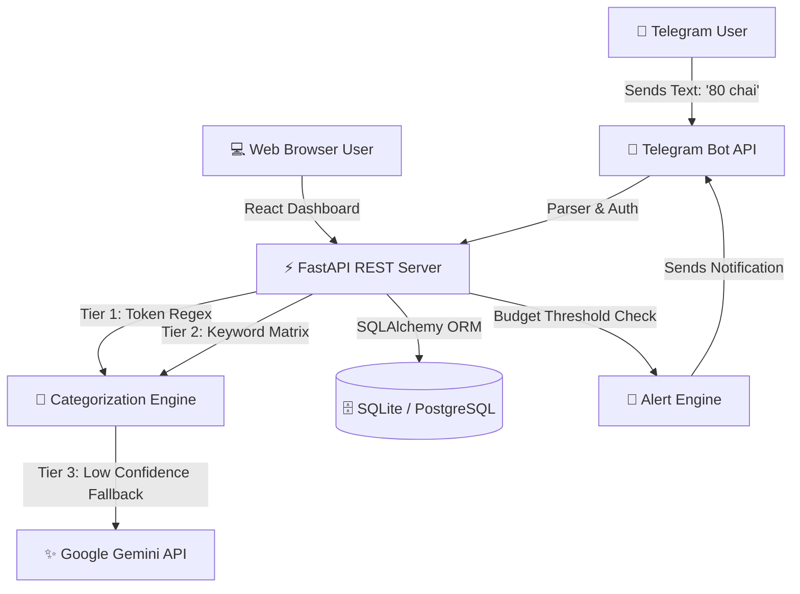
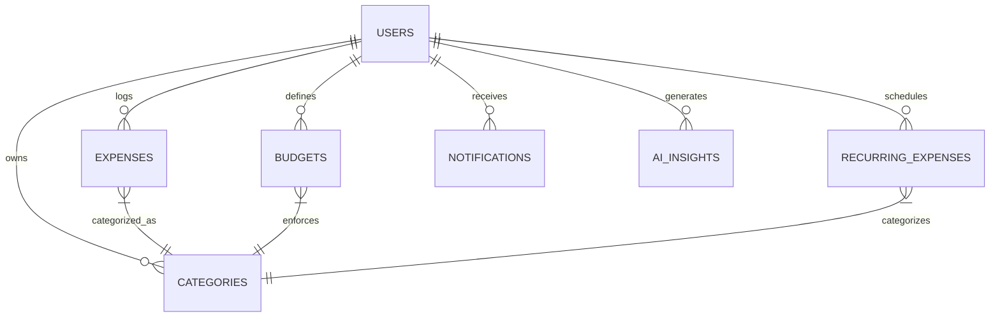

# ⚡ ExpenseSense AI — AI-Powered Personal Finance Tracker & Telegram Assistant

> A production-grade, portfolio-ready full-stack personal finance tracker that combines a **Telegram Bot** for instant natural language expense logging with a **React + Tailwind CSS Web Dashboard** for real-time analytics, AI spending insights, budget tracking, and data export.

---

## 🌟 Key Features

- 💬 **Natural Language Telegram Bot**: Simply message `80 chai`, `350 petrol`, or `1200 Amazon` in Telegram to log expenses instantly.
- 🧠 **Multi-Tier AI Categorization Engine**:
  - **Tier 1**: Instant Regex & Token Parser for amount, merchant, and payment mode.
  - **Tier 2**: Keyword Mapping Matrix matching 100+ vendors to categories (Food, Transport, Subscriptions, Entertainment, etc.).
  - **Tier 3**: Google Gemini AI Fallback Engine for complex or ambiguous natural language inputs.
- 📊 **Real-time Analytics Dashboard**: Interactive Recharts visualizations including 30-day spending trends, category share pie charts, top merchant rankings, and payment mode breakdowns.
- 🎯 **Budget System & Telegram Threshold Alerts**: Define monthly category limits and automatically receive instant Telegram notifications when reaching 80%, 90%, and 100% of your budget.
- 🔍 **Natural Language Search Engine**: Ask queries like *"How much did I spend on food this month?"*, *"Show expenses above 1000"*, or *"What was my biggest expense?"*.
- 🔄 **Auto Recurring Expenses**: Schedule bills, rent, and subscriptions to automatically log on their due dates.
- 📥 **Export Center**: One-click download center for CSV, Excel, and PDF reports.
- 🔒 **Enterprise-Grade Security**: JWT Bearer Token Authentication, bcrypt password hashing, input sanitization, and 6-digit OTP Telegram account linking.

---

## 🏗️ System Architecture



---

## 🗄️ Database Entity-Relationship Diagram (ERD)



---

## 🛠️ Tech Stack

- **Backend**: Python 3.11, FastAPI, SQLAlchemy 2.0 ORM, Pydantic v2, PyJWT, Passlib (bcrypt), `python-telegram-bot`, `google-generativeai`.
- **Database**: SQLite (Local Zero-Config Development) / PostgreSQL (Production).
- **Frontend**: React 18, Vite, Tailwind CSS, Recharts, Axios, Lucide React, React Router v6.
- **DevOps**: Docker, Docker Compose, Nginx.

---

## 🚀 Quick Start & Local Setup

### 1. Prerequisites
- Python 3.11+
- Node.js 18+

### 2. Backend Setup

```bash
# Navigate to backend
cd backend

# Create virtual environment
python -m venv venv
# On Windows:
venv\Scripts\activate
# On Linux/macOS:
source venv/bin/activate

# Install dependencies
pip install -r requirements.txt

# Start FastAPI dev server
uvicorn app.main:app --reload --port 8000
```
FastAPI Swagger Docs will be available at: `http://localhost:8000/docs`

### 3. Frontend Setup

```bash
# Navigate to frontend
cd frontend

# Install dependencies
npm install

# Start Vite dev server
npm run dev
```
React Dashboard will be live at: `http://localhost:5173`

---

## 🤖 Running the Telegram Bot

1. Open Telegram and create a new bot using `@BotFather` to obtain your `TELEGRAM_BOT_TOKEN`.
2. Add your token to your `.env` file:
   ```env
   TELEGRAM_BOT_TOKEN="your_bot_token_here"
   ```
3. Link your Telegram account to your web user account:
   - Login to the Web Dashboard at `http://localhost:5173`
   - Open **Settings** -> **Connect Telegram** to generate a 6-digit code.
   - Send `/link 123456` in your Telegram chat with the bot.

---

## 🧪 Running Automated Tests

```bash
cd backend
pytest tests/
```

---

## 📄 License
MIT License. Created for portfolio demonstration.
